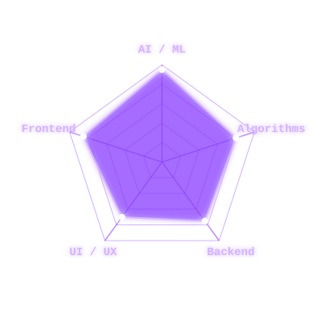

  
  
    
  

  <!-- Animated Fog GIF -->
  

---

<table border="0" width="100%">
  <tr>
    <!-- LEFT PANEL: STATS & SKILLS -->
    <td width="35%" valign="top">
      
      

        <!-- Profile Picture Placeholder -->
        
          
        <h2>STATUS</h2>
      

      <b>NAME:</b> Priyanshu Das  
      <b>CLASS:</b> AI/ML Engineer  
      <b>LEVEL:</b> 34  
      
        

      <b>[ GUILD ]</b>  
      ⛨ Antigravity (Rank: S)  

        
      
      <b>[ SKILLS ACQUIRED ]</b> 
      

        

      <b>[ CURRENT QUESTS ]</b> 
      ‣ Advanced Agentic Systems 
      ‣ 3D Web Architectures 
      ‣ Machine Learning Pipelines

        

      

        
      

    </td>
    
    <!-- RIGHT PANEL: CONTENT & PROJECTS -->
    <td width="65%" valign="top">
      
      > **[ SYSTEM NOTIFICATION ]**
      > 
      > *"The architecture of tomorrow is written today."*
      > *Title [ Elite Innovator ] acquired.*

       

      <h3>🧬 ABOUT THE ARCHITECT</h3>
      
Computational Explorer & <b>AI/ML Engineer</b> crafting high-fidelity digital twins and intelligent ecosystems. Driven by innovation, antigravity physics, and 3D aesthetics. My goal is to build systems that blur the line between software and reality.

       

      <h3>🏆 PROJECT EXCELLENCE</h3>
      
      <table border="0" width="100%">
        <tr>
          <td width="50%" valign="top">
            
          </td>
          <td width="50%" valign="top">
            <a href="https://github.com/PriyanshuDas607">
              <!-- Placeholder for another repo, user can change 'repo=' name here -->
              
            </a>
          </td>
        </tr>
      </table>

      <ul>
        <li>🥇 <b>National Hackathon Winner:</b> Developed Real-time AI Tracking Systems.</li>
        <li>🤖 <b>Antigravity AI:</b> Designing Next-Gen Agentic Tools for complex problem-solving.</li>
        <li>🌐 <b>3D Interfaces:</b> Building immersive "System" web experiences.</li>
      </ul>

       
      
    </td>
  </tr>
</table>

---

<table border="0" width="100%">
  <tr>
    <!-- BOTTOM LEFT: RADAR CHART -->
    <td width="50%" align="center" valign="middle">
      <h3>📊 SYSTEM VITALITY</h3>
      <!-- Custom Coded Spider-Net Radar Chart -->
      
    </td>
    
    <!-- BOTTOM RIGHT: SOCIAL & CONTACT -->
    <td width="50%" align="center" valign="middle">
      <h3>📡 ESTABLISH CONNECTION</h3>
       
      
        
      
        
      
    </td>
  </tr>
</table>

  

